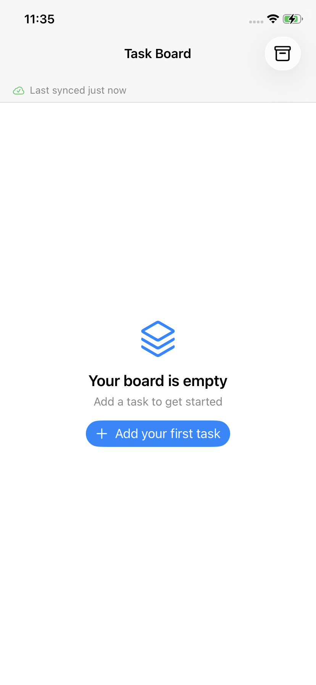
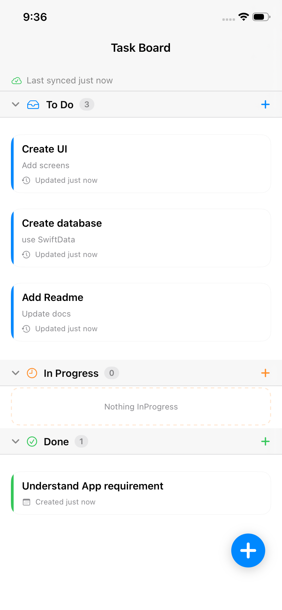
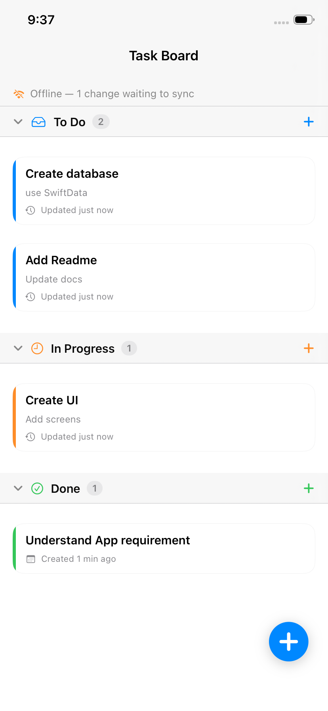
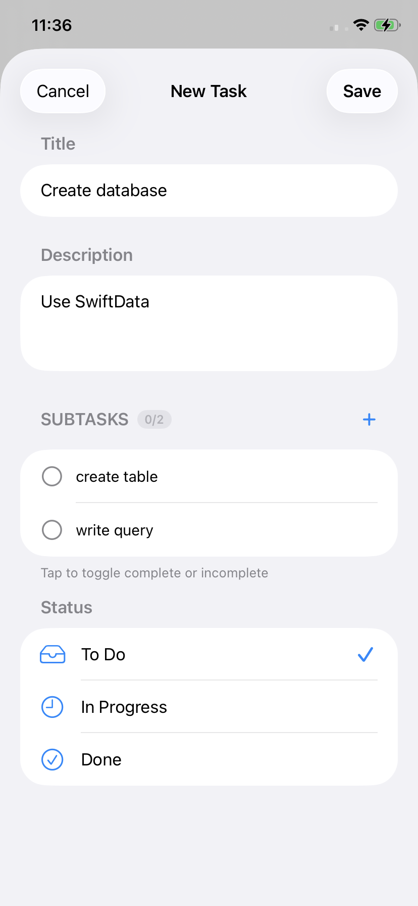

# TaskBoard App

An offline first task board for iPhone that allows users to organize tasks across a simple
workflow. Tasks can move through **To Do, In Progress, Done**, and everything works with no network, and changes sync to a Firebase
Realtime Database when one is reachable.

| First launch | The board | Unsent changes | Editing |
|:---:|:---:|:---:|:---:|
|  |  |  |  |
| Nothing to show yet | Three sections, one scroll | Queued while the server is unreachable | Edit task |

---

## Running it

```bash
open TaskBoard.xcodeproj
```

Build and run on any iPhone simulator, iOS 17 or later, or on iPhone device by adding your registered bundle id and automatic manage signing. It works immediately no configuration, no accounts, no packages to resolve.

---

## What it does

**The board** — There are three sections in one vertical scroll. Create, edit, delete,
drag to reorder, drag between sections. Sections collapse. Long press a task for
Edit, Move to, or Delete without dragging.

**Offline** — Every action works with no network. Changes are written locally,
marked pending, and sent when connectivity returns. Nothing is lost, nothing is
blocked, and the board never waits on a request.

---

## Technical decisions

* SwiftUI for creating Views, SwiftData for database, Swift Concurrency for asynchronous programming, Firebase Realtime Database for remote syncing.
* MVVM with Clean architecture for clear separation of responsibility.
* REST APIs using URLSession for remote sync.
* Network framework for monitor internet connectivity with polling of 30 seconds along with pull to refresh to sync to remote.
* Handled the failure states by showing error label where applicable.
* Database url: https://taskboard-d43b9-default-rtdb.asia-southeast1.firebasedatabase.app

---

## Known limitations

* The remote data is sync with 30 seconds poll to not throttle server, so instant update across device will be seen with 30 second lag.
* If two devices editing same task different fields, later wins as I have used last updated as source of truth.

---

## Feature to Add with more Time

* Background syncing and instant remote syncing.
* Search or filter tasks.
* Undo support after delete task.
* Allow multiple deletes and Saving deleted tasks and showing them in history.
* Unit tests.

---

## Assumptions

* Every device pointing at the same node sees the same
  tasks. No accounts, no per-user boards, no permissions.
* iOS 17 and above are supported due to use of SwiftData
* No authentication is added.

---

## Time spent

* Around 9-10 hours.

---

## AI tools used

* Used Claude and ChatGPT for syntax or pseudo code some framework like SwiftData, Network, and some part of SwiftUI complex rendering.


